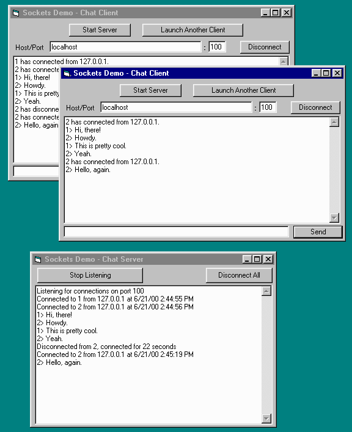



## Simple, clean client/server socket controls \(includes docs and chat demo\)

### Description

This is a set of controls designed to make creating TCP/IP client/server applications very easy. There's a single-connection client control and a server socket bank that automatically manages connections from clients. There are even discrete listener and server sockets, if you want to implement your own socket bank. This is all in an OCX and delivered with a tiny chat client/server program to demonstrate how easy it is to use. (The OCX source is included.)

While the client adds only a little functionality (and a lot of stability) to the basic Winsock control's methodology, the server socket bank offers the huge advantage of dealing with listening for incomming connections and managing them for you, a notoriously tedious and sometimes hazardous task.

These sockets controls even make dealing with sending and receiving binary data easier than with the Winsock control. They have their own internal receive buffers, which you can pick apart at your own pace as plain text or byte arrays. You can switch back and forth in mid-stream, too.

ASP/VBScript programmers should find these components useful, since you don't have to trap the events from the client socket to use it.

Perhaps the best thing about this package is that it includes extensive documentation in HTML files, which includes an introduction, explanation about how to apply them including code samples, and a complete reference for each control.

This OCX is a culmination of many years of work trying to create a suite of controls more stable and easy to use than MS's Winsock control. It's been tested out for a while by many users here. A few have recommended changes I've implemented. Otherwise, the requests I'm getting now are for minor feature changes. The package seems to be working well for those using it. I welcome your further comments and suggestions.

Please vote for my hard work if you like these components.

----

Recent Updates 

----

<LI>21 June 2000: Added documentation and new features.

<LI>26 June 2000: Bug fixes and added tutorial to help.

<LI>30 October 2000: You asked for it. ZIP now includes the OCX's source.

<LI>16 November 2000: Changed Port properties from Integer to Long.
 
### More Info
 

             |
---                |---
**Submitted On**   |2000-11-16 21:00:44
**By**             |[James Vincent Carnicelli](https://github.com/Planet-Source-Code/PSCIndex/blob/master/ByAuthor/james-vincent-carnicelli.md)
**Level**          |Intermediate
**User Rating**    |5.0 (119 globes from 24 users)
**Compatibility**  |VB 4\.0 \(32\-bit\), VB 5\.0, VB 6\.0, VB Script, ASP \(Active Server Pages\) 
**Category**       |[Internet/ HTML](https://github.com/Planet-Source-Code/PSCIndex/blob/master/ByCategory/internet-html__1-34.md)
**World**          |[Visual Basic](https://github.com/Planet-Source-Code/PSCIndex/blob/master/ByWorld/visual-basic.md)
**Archive File**   |[CODE\_UPLOAD1176311162000\.zip](https://github.com/Planet-Source-Code/james-vincent-carnicelli-simple-clean-client-server-socket-controls-includes-docs-and-chat__1-9074/archive/master.zip)

